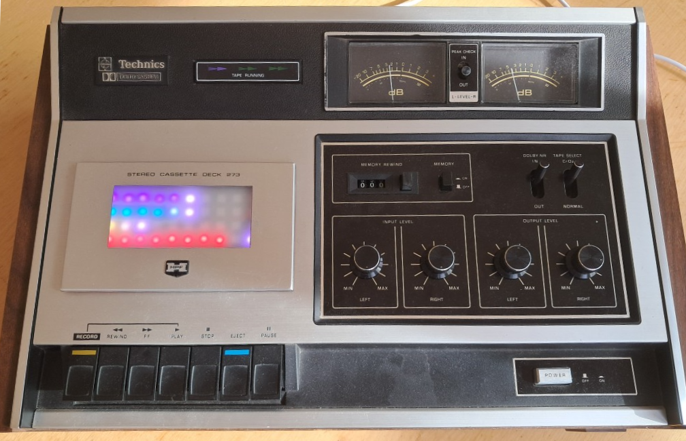
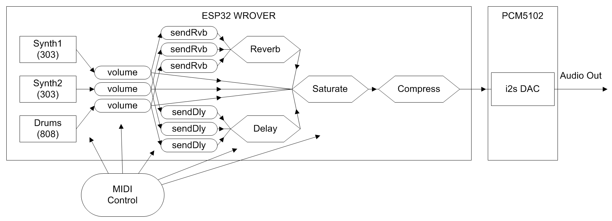
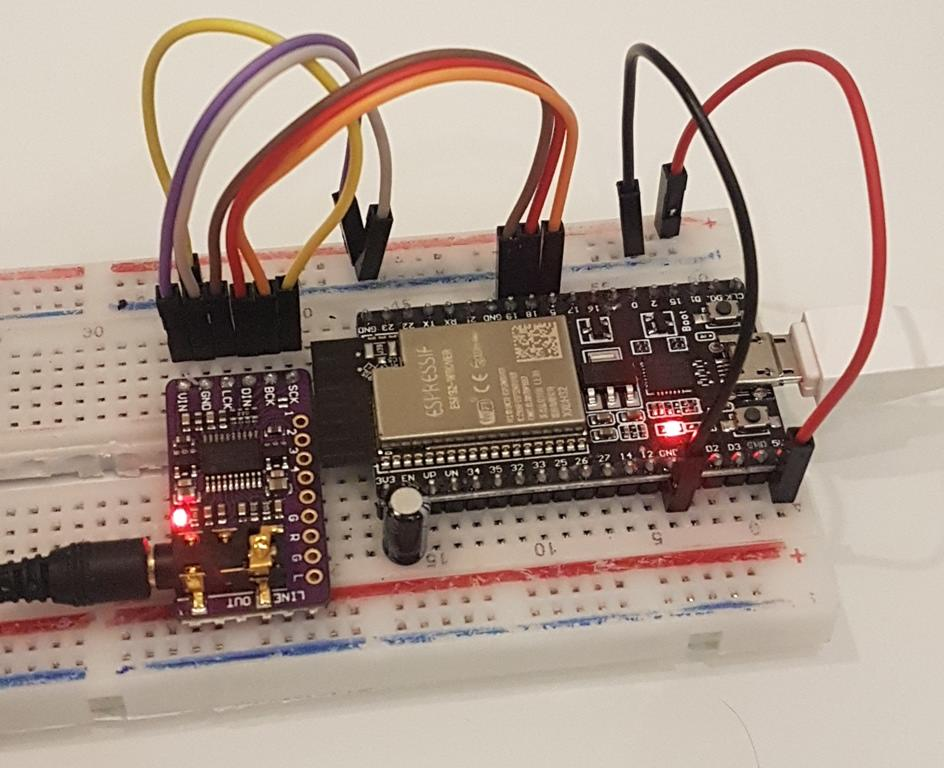
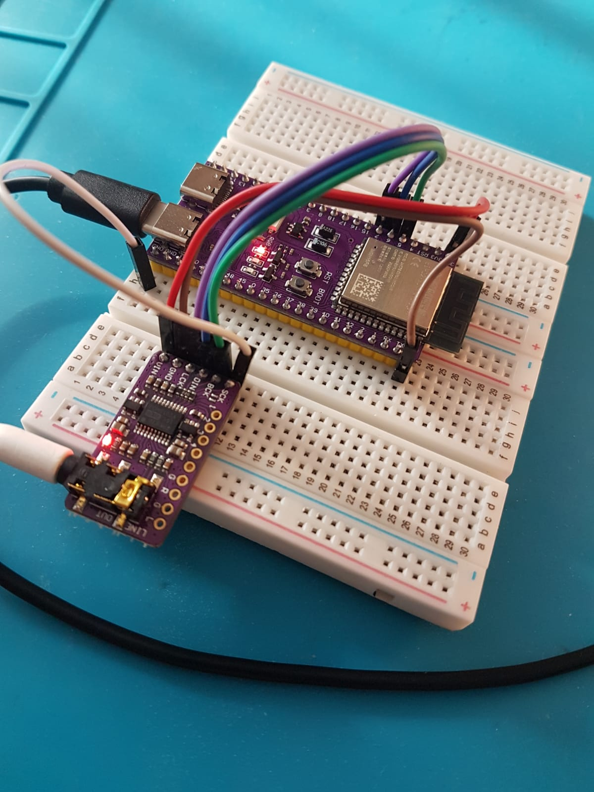

# AcidBox S3

AcidBox is a headless ESP32 groovebox-style synth:
- 2x TB-303-like synth voices
- 1x TR-808-like drum engine
- MIDI-driven control
- 44.1 kHz, 16-bit stereo I2S output (external DAC recommended)
- Optional 8-bit built-in DAC mode
- Uses both ESP32 cores

Sound shaping includes cutoff, resonance, env mod, accent, wavefolder, overdrive, drum filtering/bitcrush, reverb send, delay send, and master compression.

See [src/acidbox/midi_config.h](src/acidbox/midi_config.h) for current MIDI mapping details and channel configuration.

## Two Modes

AcidBox firmware supports two startup modes:

- `AcidBox mode`: the synth/drum engine (2x303 + 808-style drums), controlled by MIDI or Jukebox logic.
- `Streaming mode`: internet radio player mode with Wi-Fi setup, station selection, and I2S audio playback.

Mode is selected at boot from the streamer mode input pin (`STREAMER_ENABLE_PIN` in [src/constants.h](src/constants.h)).
If you change modes during runtime, the unit restarts and comes back in the newly selected mode.

## Jukebox Mode

When `JUKEBOX` is enabled in [src/acidbox/config.h](src/acidbox/config.h), AcidBox can run as an autonomous acid generator.

Pattern generation is based on the original Acid Banger concept:
- http://tips.ibawizard.net/acid-banger/
- https://github.com/vitling/acid-banger

## Demo

### YouTube
[](https://www.youtube.com/watch?v=mhCWuZB_Tos)

### Audio Samples
- [demo4.mp3](https://github.com/copych/AcidBox/blob/main/media/acidjukebox4.mp3?raw=true) - automated breaks and fills
- [demo5.mp3](https://github.com/copych/AcidBox/blob/main/media/acidjukebox5.mp3?raw=true) - 7 minutes of autonomous acid

## Internet Radio

Depending on the mode detected at startup, this unit also operates as an internet radio box for playing Rinse FM and other online radio stations.

On first boot (or when Wi-Fi credentials are missing), the unit starts a Wi-Fi setup portal so you can choose an SSID and enter the password.

The player supports MP3 streams and AAC streams (AAC requires ESP32-S3 with PSRAM).

## Integration: Tape Deck MIDI Controller

This project can be paired with the external controller project:

- https://github.com/andyvans/tapedeck-midi-acidbox

 Cassette deck integration

In that setup, AcidBox runs as the synth/drum sound engine while the tape deck project acts as a MIDI control surface and transport-style interface. This gives you a physical, performance-oriented workflow for driving patterns, parameters, and playback behavior.

### How the control link works

The tape deck project sends MIDI messages to AcidBox, typically including:

- Note On / Note Off for triggering synth and drum voices
- Control Change (CC) for parameters such as cutoff, resonance, decay, accent, delay, and reverb
- Optional transport-style actions mapped to specific MIDI events

On the AcidBox side, incoming MIDI is parsed and routed to synth/drum engines, where each CC updates the corresponding parameter in real time.

At the same time, the tape deck controller keeps a local copy of the values it sends and renders those values on its display, so the UI reflects the active parameter state while you perform.

When integrating the two projects, make sure both sides use matching MIDI channel assignments and CC mappings.

Project write-up and build notes:

- https://www.codify.nz/acidbox-tape-deck/

## Radio Config

The station list and startup behavior are controlled by [radio-config.txt](radio-config.txt), which is downloaded at startup from the URL set in [src/main.cpp](src/main.cpp).

For reliable streaming, an ESP32-S3 with an external IPX antenna is recommended to improve Wi-Fi signal strength and reduce dropouts.

1. Line 1: default channel index (0-based)
2. Line 2: startup volume (0.0 to 1.0)
3. Remaining lines: `stream_url, station_name`

Example:

```txt
0
0.9
https://admin.stream.rinse.fm/proxy/rinse_uk/stream, Rinse FM UK
http://stream.srg-ssr.ch/srgssr/rsj/mp3/128, Radio Swiss Jazz
```

## Hardware Notes

Recommended:
- ESP32 or ESP32-S3 with PSRAM (4 MB+ recommended)
- External I2S DAC (for example PCM5102)

The current PlatformIO setup in this repo targets ESP32-S3 N16R8 (16 MB flash, 8 MB PSRAM).

## Build (PlatformIO Recommended)

Open the project in VS Code + PlatformIO.
Dependencies are downloaded automatically from [platformio.ini](platformio.ini).

### 1) Confirm Board and Memory Config

Review [platformio.ini](platformio.ini), especially:
- `board`
- flash/PSRAM settings
- partition file (`acidbox_16MB.csv`)

Reference board configs:
https://github.com/sivar2311/ESP32-PlatformIO-Flash-and-PSRAM-configurations#esp32-s3-wroom-11u-n16r8

### 2) Build

Use PlatformIO task `Build` (or `pio run`).

### 3) Prepare Flash and Filesystem

Use PlatformIO tasks:
1. `Erase Flash`
2. `Upload Filesystem Image`

This is required to install sample data from the `data/` folder.

### 4) Upload Firmware

Use PlatformIO task `Upload`.

## Arduino IDE (Alternative)

If using Arduino IDE:
- Board: ESP32 Dev Module (or ESP32S3 Dev Module)
- Partition scheme: No OTA (1MB APP / 3MB SPIFFS) or equivalent for your target
- PSRAM: Enabled / correct PSRAM type

Also upload drum/sample assets to filesystem (FatFS/LittleFS workflow depending on core/tooling).

## MIDI Control Reference

Current CC mapping used by the synth/drum engines:

```c
// 303 synth CC
#define CC_303_PORTATIME    5
#define CC_303_VOLUME       7
#define CC_303_PORTAMENTO   65
#define CC_303_PAN          10
#define CC_303_WAVEFORM     70
#define CC_303_RESO         71
#define CC_303_CUTOFF       74
#define CC_303_ATTACK       73
#define CC_303_DECAY        72
#define CC_303_ENVMOD_LVL   75
#define CC_303_ACCENT_LVL   76
#define CC_303_REVERB_SEND  91
#define CC_303_DELAY_SEND   92
#define CC_303_DISTORTION   94
#define CC_303_OVERDRIVE    95

// 808 drums CC
#define CC_808_VOLUME       7
#define CC_808_PAN          10
#define CC_808_RESO         71
#define CC_808_CUTOFF       74
#define CC_808_REVERB_SEND  91
#define CC_808_DELAY_SEND   92
#define CC_808_DISTORTION   94
#define CC_808_BD_TONE      21
#define CC_808_BD_DECAY     23
#define CC_808_BD_LEVEL     24
#define CC_808_SD_TONE      25
#define CC_808_SD_SNAP      26
#define CC_808_SD_LEVEL     29
#define CC_808_CH_TUNE      61
#define CC_808_CH_LEVEL     63
#define CC_808_OH_TUNE      80
#define CC_808_OH_DECAY     81
#define CC_808_OH_LEVEL     82

// global CC
#define CC_ANY_COMPRESSOR   93
#define CC_ANY_DELAY_TIME   84
#define CC_ANY_DELAY_FB     85
#define CC_ANY_DELAY_LVL    86
#define CC_ANY_REVERB_TIME  87
#define CC_ANY_REVERB_LVL   88
#define CC_ANY_RESET_CCS    121
#define CC_ANY_NOTES_OFF    123
#define CC_ANY_SOUND_OFF    120
```

## Functional Diagram



("Acid Banger" Jukebox drives MIDI functions like an external app.)

## Credits

- Marcel Licence: https://github.com/marcel-licence
- Infrasonic Audio: https://github.com/infrasonicaudio
- Electro-Smith DaisySP: https://github.com/electro-smith/DaisySP
- Erich Heinemann: https://github.com/ErichHeinemann
- Dimitri Diakopoulos MoogLadders: https://github.com/ddiakopoulos/MoogLadders
- Open303 project: https://sourceforge.net/projects/open303/
- Open303 discussion: https://www.kvraudio.com/forum/viewtopic.php?t=262829

## Hardware Photos

 ESP32 proto

 ESP32-S3 proto
